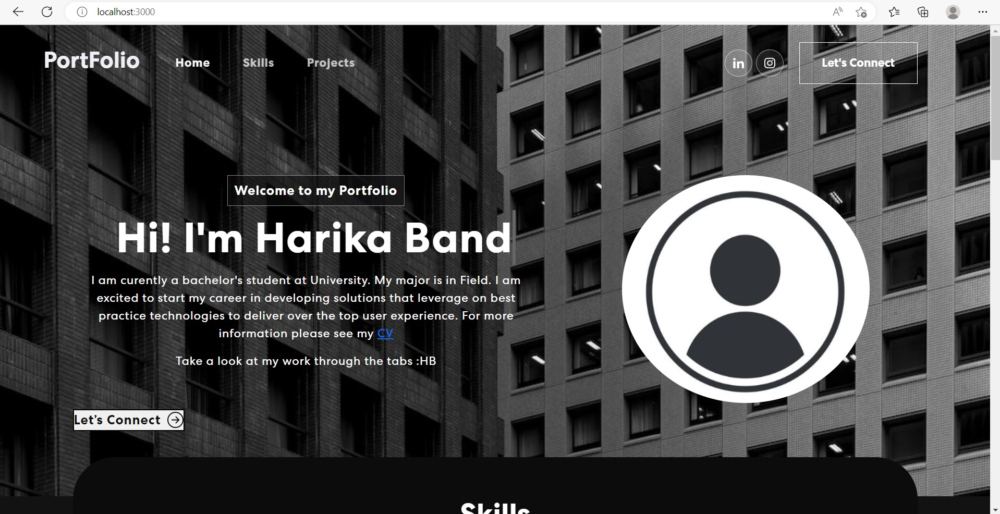

# Digital_Gallery

###### _{Developed a demo portfolio using React JS and Bootstrap. This portfolio includes mainly 4 sections home, skills, projects and connect us}_

## Available Scripts

In the project directory, you can run:

### `npm start`

Runs the app in the development mode.\
Open [http://localhost:3000](http://localhost:3000) to view it in your browser.

### `npm test`

Launches the test runner in the interactive watch mode.\

### `npm run build`

Builds the app for production to the `build` folder.\
It correctly bundles React in production mode and optimizes the build for the best performance.

## Learn More

To learn React, check out the [React documentation](https://reactjs.org/).

### References
(https://www.youtube.com/watch?v=hYv6BM2fWd8&t=4833s)
